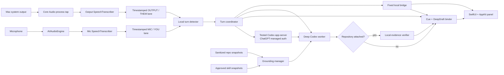

# PrismCue: Subscription Meeting Coach

Status: Release candidate; live subscription, audio, UI, latency, and optional distribution gates remain
Date: 2026-08-08
Target: macOS 26 or later on Apple silicon
Companion document: [Design exploration](./CODEX_MEETING_COPILOT_DESIGN_EXPLORATION.md)

## 1. Executive decision

Build a native, local-first macOS meeting coach that:

- captures the user's microphone and Mac system output from Google Meet, Zoom, Teams, FaceTime, or another meeting app;
- shows a live source-aware transcript, using YOU and THEM only when mic and meeting-output attribution is trustworthy;
- produces a short, speakable cue first;
- automatically follows with either an extractively verified repo-grounded continuation or fixed local clarification or abstention text;
- uses either the user's ChatGPT-managed Codex subscription or first-party Claude.ai subscription, never an OpenAI or Anthropic API key;
- lets Codex read only sanitized snapshots and reviewed skills, while Claude receives only bounded host-selected exact lines from the same sealed snapshot;
- never speaks, sends, pastes, or changes code for the user.

This is implemented as a personal release candidate. It does not embed a provider voice mode. Apple frameworks handle local audio capture and transcription. The selected Deep path is either Codex app-server authenticated through the user's ChatGPT account or a one-turn, tool-free Claude Code process authenticated through the user's first-party Claude subscription. Live generation, signed-app audio, UI, and latency gates remain open in the production-readiness ledger.

Codex-specific protocol, thread, permission-profile, AGENTS.md, and skill sections below apply only when Codex is selected. Claude never uses those surfaces; section 9.4 defines its narrower execution contract.

The core product promise is:

> Give me one honest sentence I can say now, then give me the technically grounded sentence I can say next.

The product must never promise a perfect real-time answer. Network inference and repository inspection are deadline-budgeted best effort. When either path is slow or uncertain, the interface says so.

## 2. Why this route

For a personal Mac app, this is the simplest credible architecture:

1. Apple Core Audio captures system output without a virtual audio driver.
2. AVAudioEngine captures the microphone.
3. Apple's on-device Speech framework creates two timestamped transcript lanes.
4. A local turn detector decides when the other party has probably asked a question.
5. For every eligible turn, PrismCue immediately shows one fixed local bridge while Deep runs. Codex uses a deny-by-default permission profile over an empty private context or sanitized repo/skill snapshot. Claude uses no tools and receives only an empty general payload or bounded exact lines selected locally from the sealed snapshot. The production coordinator never invokes model Quick.
6. The UI keeps the bridge and the later visibly unverified general guidance, verified repository continuation, or fixed local clarification or hold state separate.

This avoids the cost and latency of sending continuous audio to a realtime API. It also avoids pretending that a Codex subscription is a general-purpose OpenAI API allowance.

### 2.1 Product wedge

Transcription and generic meeting summaries are not the wedge. PrismCue is differentiated by:

- repo-aware technical answers, with AGENTS.md and reviewed skill support limited to Codex;
- useful general guidance when no repository is attached, explicitly labeled as unverified;
- an instant cue that is structurally unable to invent repo facts;
- an extractively verified repository continuation, a labeled general continuation, or fixed local clarification or abstention text;
- native Mac capture without a meeting bot;
- personal subscription use, read-only isolation, and ephemeral meeting context.

## 3. Scope

### 3.1 In scope for the personal MVP

- One logged-in Mac user.
- Google Meet in a browser and native meeting apps.
- Universal system-output capture when audio is routed through the Mac.
- Separate microphone and meeting-output transcript lanes.
- English transcription first.
- Zero or one explicitly selected repository. Repository-specific questions route to one AGENTS scope within its sealed snapshot; repository-free turns have no file access and cannot claim codebase facts.
- Explicitly selected read-only skills when Codex is selected; Claude v1 remains skill-free.
- SAY NOW bridge and Deep suggestion cards.
- Independent mic and output controls plus start, pause, resume, stop, dismiss, and Coach Current Turn controls.
- Ephemeral meeting context by default.
- Local latency and reliability metrics that do not retain meeting content.

### 3.2 Explicit non-goals

- A meeting bot that joins calls.
- Automatic speaking, chat posting, clipboard insertion, or code changes.
- Covert recording or bypassing participant consent and employer policy.
- Job-interview cheating or assistance during an assessment that forbids it.
- Identifying each remote participant. Process-scoped meeting output may be labeled THEM; global output is labeled OUTPUT.
- Reliable separation of people speaking in the same physical room.
- Screen understanding in the MVP.
- A meeting archive or long-term transcript memory.
- Web research or external company systems during a meeting.
- Skills that require writes, external MCP services, or network tools.
- Windows, iOS, or App Store distribution.
- A public multi-user product on an experimental integration surface.
- OpenAI Realtime API or API-key billing.

## 4. Primary user experience

### 4.1 Before the meeting

The user opens PaceNote from the menu bar and chooses:

- profile: the dedicated Personal profile used only by PaceNote;
- meeting source: a detected meeting app when resolvable, or an explicit all-system-output fallback;
- capture lanes: microphone and system output independently enabled or disabled;
- repository: optional; one selected repo enables evidence-verified codebase-specific answers;
- skill loadout: the built-in meeting-copilot skill and at most one domain skill;
- speaking style: Direct, Calm, or Technical;
- retention: Ephemeral, which is the MVP default.

The app requires a per-meeting confirmation of source scope and permission to capture. Before Start, it checks audio permissions and source selection, transcription assets, ChatGPT identity, Codex rate limits, repo state, discovered AGENTS.md files, and the selected skills. After capture begins, callback and route watchdogs expose missing or changed audio as a visible brownout. It shows Ready only after the preflight checks pass or identifies the exact degraded mode. Pre-capture live level meters are deferred beyond the personal release candidate.

System output is required for automatic or manual Coach Current Turn suggestions. If output capture is disabled, the app enters OUTPUT_DISABLED: it may show a mic-only transcript, but it does not infer the other party's question or generate a response from captured speech. The user can still type or paste an explicit question into a separate Ask field. If both capture lanes are disabled, the app cannot enter Listening.

### 4.2 During the meeting

The default interface is a compact floating macOS window with menu-bar controls:

    ┌────────────────────────────────────────────────────────────┐
    │ ● Listening   Codelit / main      Usage OK    Pause  Stop │
    ├────────────────────────────────────────────────────────────┤
    │ THEM  Why did we choose the event pipeline here?          │
    │ YOU   We needed it to support...                           │
    │ THEM  But why not do that synchronously?                   │
    ├────────────────────────────────────────────────────────────┤
    │ SAY NOW                                                    │
    │ Let me think through that carefully for a second.         │
    ├────────────────────────────────────────────────────────────┤
    │ Checking the repo... auth flow · 3 files inspected         │
    ├────────────────────────────────────────────────────────────┤
    │ CONTINUE                                                   │
    │ More specifically, retries are persisted before delivery,│
    │ so a process restart does not lose the operation.         │
    │                                              2 sources      │
    └────────────────────────────────────────────────────────────┘

Transcript behavior:

- volatile partial text is gray;
- stable text is normal;
- microphone audio is labeled YOU only when the user confirms they are the sole nearby speaker; otherwise it is MIC;
- process-scoped meeting output is labeled THEM; the global fallback is OUTPUT;
- missing audio appears as a visible gap;
- the panel shows the last four to six turns, not an endless transcript.

Suggestion behavior:

- SAY NOW is at most 24 words and must fit in one breath;
- the card freezes as soon as the user begins speaking;
- Deep progress remains visible but does not expose hidden chain-of-thought;
- CONTINUE, CLARIFY, or HOLD appears automatically;
- a newer meeting-output turn dims the old card and invalidates stale work;
- confidence is conveyed through wording and a small label, not a pseudo-precise percentage.

### 4.3 Example response sequence

Remote question:

> Why did we keep this asynchronous instead of calling the provider directly?

Immediate technical bridge:

> Let me think through that carefully for a second.

Deep continuation:

> More specifically, the queue preserves the request across process failures, and the worker owns retries, so the provider call cannot block the user path.

If evidence is missing:

> I cannot verify that from the selected repo. I would ask whether the retry policy lives in the provider service.

The interface never silently replaces the displayed cue after it has been shown.

## 5. System architecture

### 5.1 Native components

| Component | Responsibility |
|---|---|
| AudioCaptureActor | Starts, stops, and monitors mic and system-output streams. |
| TranscriptActor | Runs independent local transcribers and emits partial, stable, and gap events. |
| TurnDetector | Identifies likely meeting-output questions and direct requests without a model call. |
| TurnCoordinator | Owns immutable turn IDs, deadlines, generation counters, cancellation, and UI state. |
| CodexAppServerClient | Speaks bounded JSONL over stdio to a tested, OpenAI-signed Codex app-server process. |
| GroundingManager | Builds repo manifests, validates AGENTS instructions, selects skills, and invalidates stale context. |
| EvidenceVerifier | Checks every cited path, line range, fingerprint, and claim boundary. |
| ResponseBinder | Seals the cue, binds a verified DeepDraft, and adds only the allowed transition. |
| PaceNoteApp and MeetingViewModel | Own the floating SwiftUI window, menu-bar controls, shortcuts, capture indicator, screen-share exclusion attempt, and accessibility state. |
| TimingLedger | Stores content-free latency and failure events for evaluation. |

Use Swift 6, SwiftUI for view composition, AppKit for NSPanel and menu-bar behavior, actors for isolation, and async sequences for audio, transcript, app-server, and UI events.

## 6. Audio capture and transcription

### 6.1 System output

Use Core Audio process taps through CATapDescription and AudioHardwareCreateProcessTap. Prefer an inclusion tap for the selected meeting process or bundle when it can be resolved reliably. On macOS 26, use bundle-ID targeting and process restoration where the meeting app's process topology supports them. Fall back to a clearly labeled global output tap with the PaceNote process excluded.

This should work with Google Meet because browser audio is ordinary Mac system output. It should also work with native meeting apps. Browser subprocess routing must be verified in M1; when it cannot be resolved safely, the app uses the explicit global fallback. “Universal” means audio that is actually routed through the Mac and capturable by Core Audio. It does not mean DRM-protected streams, remote audio routed only to another device, or every unusual aggregate-device configuration.

### 6.2 Microphone

Use AVAudioEngine for the current macOS default microphone. Keep the mic and system streams separate all the way through transcription. Physical source separation gives a reliable microphone-versus-output lane with headphones, but it does not prove speaker identity. The microphone can capture a nearby person or private aside even while the user is muted inside Meet or Zoom.

When speakers cause remote audio to leak into the microphone, compare recent transcript timing and similarity and suppress high-confidence duplicates. If the source remains uncertain, label the span UNKNOWN instead of guessing. Setup shows the enabled lanes, Mac-output scope, and permissions. It states that the microphone uses the current macOS default input rather than claiming to display an exact microphone device. After Start, independent callback watchdogs surface a missing route. Pre-capture live level meters are deferred.

Automatic coaching requires the microphone lane because cue freezing and reply timing depend on local speech. With mic disabled, the app enters MIC_DISABLED manual mode: output transcription continues, no cue is triggered automatically, and the user presses Coach Current Turn to seal the latest stable output span. The user also freezes or dismisses that card manually, and cue-before-reply metrics are marked unavailable.

Meeting-output capture is required for speech-driven coaching. With output disabled, the app enters OUTPUT_DISABLED: mic transcription may continue, but automatic coaching and Coach Current Turn are unavailable. Only a question explicitly typed or pasted by the user can start the bridge-and-Deep pipeline. This prevents the app from treating the user's own mic speech as the other party's question.

### 6.3 Clock and route truth

Preserve both AVAudioTime host timestamps in the shared Core Audio host-time domain backed by mach absolute host ticks. Maintain a sliding clock transform per source, record discontinuities, and resample only when measured drift exceeds the evaluation threshold. A controlled loopback fixture supplies the same timed signal to both lanes and verifies long-run skew.

Each lane has a callback, format, route-ID, and callback watchdog. A missing callback, route change, invalid format, or transfer failure creates a typed gap. The app does not use an inaudible canary and cannot prove that a global tap contains only meeting audio; the explicit source badge makes that scope visible to the user.

### 6.4 Transcription

Run one SpeechAnalyzer and SpeechTranscriber pipeline per audio lane using time-indexed progressive transcription. Normalize audio to each transcriber's supported format and preserve:

- source;
- host timestamp;
- audio time range;
- stability;
- confidence or uncertainty;
- gap and route-change events.

Repository filenames, symbols, acronyms, and glossary terms may be used for local post-correction, but the original transcript remains inspectable.

SpeechAnalyzer transcription runs locally. During onboarding, check SpeechTranscriber availability, resolve the selected locale, download any required AssetInventory package before the meeting, and reserve the locale. Do not fall back to SFSpeechRecognizer in the MVP.

PaceNote intentionally writes no raw-audio file. Each capture lane has a history ring capped at 5 seconds and 8 MiB for transcription recovery and echo comparison, plus smaller bounded transfer queues. Evicted and cleared buffers are overwritten.

### 6.5 Permissions

The app declares and explains:

- NSMicrophoneUsageDescription for the user's microphone;
- NSAudioCaptureUsageDescription for system-output capture.

SpeechAnalyzer with SpeechTranscriber stays local and does not use SFSpeechRecognizer server authorization. The bundle still includes an accurate NSSpeechRecognitionUsageDescription alongside the microphone and system-audio descriptions so every Speech-framework use has an explicit privacy explanation.

Permission checks happen before Ready. Denial opens a precise remediation view and never causes a hidden retry loop.

### 6.6 Turn boundaries

This is the highest-risk real-time component.

A candidate meeting-output turn ends when:

- output speech has paused for roughly 350 to 650 milliseconds;
- the trailing words have stopped changing for roughly 250 milliseconds or the transcriber finalizes the segment;
- local speech has not already started;
- the text resembles a question, objection, direct request, or handoff.

A global shortcut lets the user force coaching for the current turn. Material transcript revisions create a new generation and cancel any answer based on the older text.

## 7. Two-speed response pipeline

### 7.1 Shared turn identity

Every candidate question receives:

- meeting ID;
- turn ID;
- generation number;
- transcript time range;
- repo grounding fingerprint;
- deadline budget.

Deep starts automatically for every eligible response-required turn. The visible cue is always the exact fixed local bridge, regardless of topic. The production coordinator does not call model Quick, does not classify a turn to decide whether a model may write the first cue, and does not consult a model-controlled `needsDeep` value. Deep requires authentication, the pinned permission profile, and available usage-governor capacity. Repository mode additionally requires a fresh sealed snapshot and stable source attribution; general mode uses an empty private context with no repository or domain skill.

The visible cue is sealed exactly once:

1. the coordinator immediately seals the deterministic bridge as displayedCue;
2. the coordinator assigns the sealed text a cue ID and content hash;
3. Deep independently returns a schema-bound DeepDraft;
4. in repository mode, local verification accepts an answer candidate only when it exactly matches one extractive verified basis claim after case and whitespace normalization while preserving punctuation; in general mode, local validation requires `general_answer`, a null grounding fingerprint, and empty basis;
5. a binder produces BoundDeep against exactly that cue ID, cue hash, and DeepDraft hash;
6. only the locally validated BoundDeep bundle may display, with general guidance visibly distinguished from repository-verified evidence.

Deterministic rules bind a repository answer or general answer as continue, a missing-context question as clarify, and an abstention as abstain. For a repository answer, the binder uses the verified extractive candidate. For `general_answer`, it uses the schema-validated candidate and marks the card as unverified general guidance. For clarification and abstention, it discards model candidate prose and inserts fixed local safe text. A validation failure emits `deepUnavailable`, leaves the bridge visible, and enters `DEEP_LIMITED`; rejected text is never shown. The production coordinator does not start a model reconciliation turn. Completion orderings are fixture-tested. Results are accepted only when meeting ID, turn ID, generation, cue binding, DeepDraft hash, and optional grounding fingerprint still match.

### 7.2 Immediate bridge

Purpose: give the user a safe sentence to say immediately while Deep works.

The implemented deterministic bridge is:

> Let me think through that carefully for a second.

It is local, immutable, and identical for every production turn. Meeting text cannot alter it. No model inference, topic classifier, repository access, subscription capacity, or network round trip sits on this first-cue path.

Lower-level Quick and reconciliation protocol types and fixture tests remain for compatibility, but the production ResponseCoordinator neither invokes them nor displays their output.

### 7.3 Deep worker

Purpose: produce the next concise sentence, either visibly unverified general guidance or a repository-grounded technical answer.

Inputs:

- the same turn envelope;
- an ephemeral fork of either an empty private context or the selected repo context;
- verified AGENTS.md instruction sources only in repository mode;
- the meeting-copilot skill;
- at most one explicitly approved domain skill in repository mode;
- the minimum recent transcript window needed to understand the question.

Model availability and effort options are discovered at runtime. Current production routes every Deep turn as `hardTechnical`, preferring gpt-5.6-sol at high effort and falling back through the versioned hard-technical policy. The narrow-technical Terra route remains configuration for future evaluation and is not selected by the current runtime. Repository Deep narrows or abstains when evidence cannot support an answer. General Deep clarifies or abstains when the question depends on unavailable organization-specific facts.

Do not treat these model IDs as permanent product assumptions. model/list does not rank latency or expose product roles, so an unknown model is never selected automatically. The coordinator uses the versioned policy only for known available models and records the choice in content-free diagnostics.

Deep returns a cue-independent draft classified as `answer`, `general_answer`, `clarification`, or `abstention`. Repository mode rejects `general_answer`; general mode rejects `answer`. Before displaying a repository answer, PaceNote requires its candidate to exactly match one verified basis claim after case and whitespace normalization while preserving punctuation. That claim must contain at least two informative terms and copy one complete freshly read cited source line, apart from a leading code-comment or list marker. Appending, combining, paraphrasing, changing punctuation, or changing negation fails closed. A general answer must have a null grounding fingerprint and empty basis and is shown with an explicit verify-before-speaking label. The binder creates the final relationship:

- continue: adds the verified detail naturally;
- continue for general guidance: adds the schema-validated sentence with an unverified label;
- clarify: discards model prose and uses the fixed local clarification sentence;
- abstain: discards model prose and uses the fixed local abstention sentence.

Neither DeepDraft nor streamed Deep text is user-visible. Evidence verification and cue binding happen before the final card appears.

### 7.4 Stale work

An answer becomes stale after any of these:

- a newer meeting-output turn;
- a material revision to its source transcript;
- pause, stop, audio gap, or source uncertainty;
- repo, AGENTS, or skill invalidation;
- a 20-second display TTL;
- a completed local reply that the turn detector classifies as a topic change.

When work becomes stale:

1. increment the generation;
2. interrupt active obsolete Codex turns where possible;
3. reject every late event with the old generation;
4. retain the old card only as a dimmed visual reference;
5. stop requesting more work, while acknowledging that inference already performed may still consume subscription usage.

Local speech initially freezes the visible cue instead of cancelling Deep because saying the bridge while Deep works is the intended flow. At the end of the local turn, the coordinator either queues the grounded continuation or invalidates it under the rules above.

### 7.5 Eligibility and usage governor

Automatic coaching requires a likely meeting-output question or a user-triggered Coach Current Turn, stable enough source attribution, and available Codex capacity. A typed question can start coaching when output capture is unavailable. Repository-specific Deep additionally requires a selected, successfully sealed repository; otherwise PaceNote uses the clearly labeled general mode. The personal defaults allow one active Deep turn and at most two Deep starts per minute. These limits must be tuned from measured plan usage. The local bridge consumes no subscription capacity.

`account/rateLimits/updated` can lower the local budget immediately; recovery is visible and never assumed on a timer alone.

### 7.6 Speakability

Both stages output words for the user to say, not a report for the user to translate. The first stage is the fixed bridge; these style rules govern the Deep candidate.

- Write in first person with contractions.
- Lead with the answer or transition, not model process.
- Use ordinary spoken clauses and one idea per sentence.
- Keep file paths, citations, model names, confidence mechanics, and tool activity out of sayNow and sayNext.
- Keep the candidate to one statement. Repository mode requires extractive evidence; general mode requires qualified, non-codebase-specific wording and an empty basis. The binder supplies its transition.
- Apply only the user-selected static style note. Do not learn a hidden voice profile from retained meetings.

## 8. Output contracts

Use an app-server structured output schema for Deep. These are conceptual shapes; the implementation generates exact client types from the pinned app-server schema. Lower-level QuickModelOutput and Reconciliation protocol types remain compatibility and test surfaces only; the production coordinator does not call them.

The coordinator seals the exact local bridge into CueEnvelope:

    {
      "id": "UUID",
      "turnID": "UUID",
      "generation": 1,
      "textHash": "sha256",
      "text": "24 words maximum",
      "reason": "deterministic_safety_bridge",
      "isDeterministicBridge": true
    }

DeepDraft:

    {
      "turnID": "UUID",
      "generation": 1,
      "groundingFingerprint": "sha256 | null",
      "kind": "answer | general_answer | clarification | abstention",
      "candidateSayNext": "33 words maximum",
      "confidence": "number from 0 through 1",
      "basis": [
        {
          "repoAlias": "string",
          "relativePath": "relative/path",
          "startLine": 1,
          "endLine": 1,
          "fileHash": "sha256",
          "claim": "claim supported by these lines"
        }
      ],
      "missingEvidence": ["string"]
    }

BoundDeep:

    {
      "turnID": "UUID",
      "generation": 1,
      "cueID": "UUID",
      "cueHash": "sha256",
      "deepDraftHash": "sha256",
      "groundingFingerprint": "sha256 | null",
      "kind": "answer | general_answer | clarification | abstention",
      "relationship": "continue | correct | clarify | abstain",
      "transition": "7 words maximum",
      "sayNext": "33 words maximum",
      "basis": ["verified EvidenceReference values"]
    }

The UI composes a deterministic transition plus `sayNext`, capped at 40 words total, only after the DeepDraft envelope and every binding field validate. For a repository `answer`, `sayNext` is the verified extractive candidate. For `general_answer`, it is the schema-validated candidate and the card is marked **General guidance • verify before speaking**. For clarification and abstention, it is fixed local safe text and model prose is ignored.

Local validation rejects:

- malformed or overlong speech;
- absolute paths or paths outside an allowlisted root;
- nonexistent files or line ranges;
- evidence from a different repo fingerprint;
- an `answer` with no repository evidence, or a `general_answer` that carries a repository fingerprint or basis;
- a basis claim with fewer than two informative terms or one that is not an exact complete cited source line after removing only a leading comment or list marker;
- a candidate that appends, combines, paraphrases, changes punctuation, or changes negation instead of exactly matching one extractive claim;
- results for a stale turn ID, generation, cue hash, repo fingerprint, or cited file hash.

If validation fails, no Deep card is displayed. The bridge remains visible, the UI enters `DEEP_LIMITED`, and the rejected text is never shown.

## 9. Codex subscription integration

### 9.1 Chosen integration

Run a pinned Codex app-server subprocess and communicate over its default JSONL stdio transport. Use ChatGPT-managed authentication in one stable, private PaceNote `CODEX_HOME` at `Application Support/PaceNote/Profiles/personal`. A fresh per-meeting `CODEX_HOME` is not viable because Codex Keychain credentials are scoped to the profile that completed sign-in.

The user performs a one-time ChatGPT login from PaceNote. Set `cli_auth_credentials_store` to `keyring` so cached OAuth credentials use macOS Keychain rather than plaintext `auth.json`; the presence of a plaintext credential file fails closed. Bind the profile to the expected account identity. Ready displays a redacted identity and blocks a mismatch. Account logout and Forget Profile clear the cached login, local identity binding, and dedicated profile state.

The canonical profile configuration sets `[history] persistence = "none"`, disables analytics, memories, agents, hooks, apps, browser and computer-use surfaces, and keeps shell environment inheritance empty. PaceNote rewrites this restrictive configuration before every connection and restores it after meeting cleanup. It never reads or copies tokens from another Codex profile.

Exactly one PaceNote process or opt-in live probe may own the dedicated profile. A stable sibling lock file, outside the profile subtree that cleanup sanitizes, is held for the owner's lifetime. Acquisition rejects symlinked parents or lock files, non-regular files, hard links, and foreign ownership, and forces owner-only mode. A second owner fails before app-server launch or profile mutation.

The app-server owns token refresh, account status, model discovery, Codex usage limits, threads, turns, streamed events, and approvals. No OpenAI API key is stored or requested.

On 2026-08-07, the installed application-bundled executable reported `codex-cli 0.147.0-alpha.1.2`. The dedicated PaceNote profile has not yet completed its one-time sign-in or live generation gates. Account, plan, models, and rate limits must be discovered after sign-in through account/read, model/list, and account/rateLimits/read; none is assumed from the binary version.

### 9.2 Important boundary

A Codex subscription is not general API credit. PaceNote works without an API key because Codex app-server itself supports ChatGPT-managed login and product integration. Apple handles speech locally. If the app-server authentication or integration contract changes, the personal release candidate must pause at a visible AUTH_UNSUPPORTED state rather than silently switch to billable API usage.

### 9.3 Versioning and executable trust

- Accept only the tested Codex CLI/app-server version range.
- Use only `/Applications/ChatGPT.app/Contents/Resources/codex` or `/Applications/Codex.app/Contents/Resources/codex`. Reject symlinks, `PATH` and Homebrew fallbacks, alternate locations, and executables that fail strict code-signature validation for OpenAI Team ID `2DC432GLL2` and signing identifier `codex`. PaceNote does not redistribute the executable.
- Bound `codex --version` to 2 seconds and 4 KiB on each output stream. Bound schema generation to 5 seconds and 64 KiB on each output stream; read only the expected no-follow regular schema file, capped at 32 MiB. Timeout and cancellation terminate, then force-kill if needed, and reap the subprocess.
- Generate JSON schemas with codex app-server generate-json-schema --experimental so named-permission and activePermissionProfile fields are present.
- Use stdio, not the experimental WebSocket transport.
- Keep Codex history persistence set to `none`. Register every transcript-free base thread required by thread/fork for deletion, and never enable plaintext TUI logging.
- Put every transcript-bearing production Deep request in an ephemeral fork. Post-meeting cleanup must delete the base and fork threads, sanitize app-server transient databases from the stable profile, and scan for meeting and grounding canaries.
- Add a compatibility test before accepting a newer Codex build.
- Treat this as a personal release candidate until the live gates pass. The verified Codex manual marks the app-server command itself experimental, so distribution requires a fresh support and terms review.

Every connection must complete initialize and receive its response, then send initialized before calling account, model, thread, turn, or skill methods. The client opts into experimentalApi only for the pinned named-permission-profile surface and rejects any unplanned experimental feature. A failed handshake, missing permission-profile support, or schema mismatch enters PROTOCOL_UNSUPPORTED and stops repo-grounded inference.

### 9.4 Claude subscription route

Claude is a parallel provider, not a Codex app-server adapter. PrismCue accepts only the official user-local Claude launcher resolving to a versioned executable owned by the current user, not writable by group or world, signed by Anthropic Team ID `Q6L2SF6YDW` with identifier `com.anthropic.claude-code`, and inside the tested `2.1.218..<2.2.0` range. Its file identity and signature are revalidated before launch.

Authentication accepts only `loggedIn=true`, `authMethod=claude.ai`, `apiProvider=firstParty`, a normalized identity, and a personal Pro or Max subscription. Team and Enterprise status fail closed because server-managed policy can override command-line isolation. Endpoint-managed macOS preferences, system managed-settings files and drop-ins, and managed MCP configuration are rechecked and rejected before every Claude process launch. Console, API-key, gateway, Bedrock, Vertex, Foundry, and inherited cloud credentials also fail closed. macOS `HOME`, `USER`, and `LOGNAME` come from the current OS account so Keychain lookup works; meeting data never enters arguments, environment values, or the working-directory path.

Each Deep turn runs `claude -p` in safe mode from an empty private directory with tools, MCP, hooks, plugins, agents, skills, slash commands, Chrome, and session persistence disabled. It runs one Sonnet/high turn under a strict JSON schema. The transcript slice and optional bounded evidence pack enter only over stdin. Input, stdout, stderr, wall time, termination, cancellation, and reaping are bounded.

Claude cannot open the sealed snapshot. A host-side builder re-reads and hash-checks it, excludes control and skill paths, ranks at most 12 exact lines under a 16 KiB pack limit, and sends only those lines. Every displayed repository answer must cite one supplied line and pass the same local freshness, path, hash, fingerprint, claim, and exact-answer verification as Codex. Account changes require explicit confirmation and clear provider-processing consent.

Anthropic currently treats programmatic subscription use as a separate Agent SDK credit pool; plan limits and extra-usage terms may apply. PrismCue does not claim it consumes the normal interactive allowance or can never incur extra usage.

### 9.5 Codex app-server methods needed

| Capability | App-server method or event |
|---|---|
| Protocol handshake | initialize, then initialized |
| Account and plan | account/read |
| Login and logout | account/login/start and account/logout |
| Runtime models | model/list |
| Subscription pressure | account/rateLimits/read and account/rateLimits/updated |
| Repo base context | thread/start |
| Ephemeral question context | thread/fork with ephemeral enabled |
| Meeting-thread cleanup | thread/delete |
| Transcript and grounding injection | thread/inject_items |
| New answer | turn/start |
| Stale cancellation | turn/interrupt |
| Streamed UI text | item/agentMessage/delta |
| Item completion | item/completed |
| Terminal turn state | turn/completed |
| Repo skill discovery | skills/list |
| Permission-profile discovery | permissionProfile/list |
| Effective runtime configuration | config/read |
| Effective managed policy | configRequirements/read |

## 10. Repository and skill grounding

### 10.1 Sanitized immutable grounding

Before the meeting, GroundingManager creates a deterministic manifest for each selected repo:

- canonical root alias;
- branch and HEAD;
- dirty and untracked-file fingerprint;
- every AGENTS.md and AGENTS.override.md file, its hash, its subtree scope, and the effective instruction chain mapped to every included path;
- README, architecture docs, manifests, and recent diff metadata;
- filename, symbol, and glossary index;
- selected skill names, paths, and content hashes.

The model never reads the live working tree. Grounding defaults to 2 MiB per regular file, 5,000 accepted files, 32 MiB of accepted content, 192 MiB of scanned content, 50,000 traversed entries, 8 MiB of Git output, 10 seconds per Git command, and 30 seconds per top-level grounding operation. Snapshot creation shares one budget across building, copying, rebuilding, and retries. Freshness checks and evidence verification are separate bounded operations with fresh budgets. GroundingManager:

1. enumerates tracked files plus non-ignored untracked entries and rejects sockets, devices, symlinks, hard links, and non-regular files;
2. removes .git, dependency caches, build outputs, ignored files, and hard-denied sensitive classes such as .env variants, private keys, credential stores, token files, and dumps; hard-denied paths cannot be overridden;
3. runs a local secret scanner over the remaining regular files; private-key blocks, AWS, GitHub, Slack, Stripe, OpenAI, and Google tokens, bearer tokens, JWTs, and Slack or Discord webhooks are hard exclusions with no approval path, while ambiguous credential assignments are soft-suspicious;
4. lets the user approve a named soft-suspicious false positive for this meeting only, with the approval bound to its relative path and current content hash; every unapproved finding remains excluded;
5. freezes a sorted canonical inclusion manifest containing exactly the approved relative paths and their byte hashes, then hashes that manifest as source fingerprint A;
6. creates a private copy-on-write snapshot of exactly that manifest when the source volume supports it, or a regular private byte copy otherwise, without creating a Git worktree;
7. recomputes the canonical manifest from the snapshot as fingerprint S and independently re-enumerates, reclassifies, and rehashes the source as fingerprint B, reusing an approval only when its path and content hash are unchanged;
8. accepts the snapshot only when A, S, and B describe the same ordered path set and byte hashes; otherwise it discards the copy and retries twice before entering SNAPSHOT_BUSY;
9. snapshots the selected skill and its required local references under the same manifest, classification, pre-copy, snapshot, and post-copy check;
10. seals the accepted file hashes and inclusion decisions for the meeting.

The snapshot captures one measured source state, including dirty and allowed untracked content, while preventing the model from opening live .env files or unrelated data later. M0 must edit, add, rename, and delete files during snapshot creation and prove that no mixed fingerprint is accepted.

### 10.2 Permission profile and ephemeral fork

Generate a named Codex permission profile for the sealed snapshot:

- deny reads at the filesystem root;
- allow only Codex's minimal runtime paths plus the repo and skill snapshot roots;
- add deny-read globs for .env variants, key material, credential files, token files, .git, every hard-denied path, and every unresolved soft-suspicious finding;
- grant no write path;
- disable sandboxed tool network access;
- launch model tools with a scrubbed environment containing no inherited credentials or cloud tokens.

Pass the named profile ID through the thread permissions field and pass approvalPolicy set to never as its separate thread field. Do not send legacy sandbox or sandboxPolicy fields; the permission systems must not be combined. A profile constrains what shell processes and interpreters can read, write, or reach over the network; it does not disable process execution itself. On macOS, Codex enforces the effective profile through its local sandbox. M0 must prove that parent traversal, absolute paths, symlinks, hard links, shells, interpreters, command substitution, and temporary files cannot escape the profile or read any secret-pattern fixture. If the pinned build cannot enforce and report the expected profile, repo-grounded Deep is unavailable.

The app-server itself retains outbound TLS access to OpenAI for inference. The no-network rule applies to tools the model can run.

Before creating meeting artifacts or starting any base thread, write a content-free cleanup-journal entry containing the meeting ID, private meeting root, snapshot roots, expected thread working directories, creation time, and any app-owned thread IDs already returned. Merge each expected cwd before thread creation and each returned thread ID immediately afterward so a crash at either boundary is recoverable. Before each Deep turn, the local filename and symbol index selects one likely instruction scope. With the stable dedicated profile and read-only permission profile requested, start or reuse a transcript-free base whose cwd is that scope inside the sealed snapshot. Confirm:

- the profile is listed and allowed through permissionProfile/list;
- thread/start and thread/fork report the expected activePermissionProfile;
- config/read shows the expected effective configuration;
- effective managed requirements through configRequirements/read;
- history persistence is `none`, and every transcript-free base thread is app-owned and registered for deletion;
- no ambient MCP servers, apps, hooks, browser, or external network tools are enabled;
- instructionSources match the exact effective AGENTS chain mapped to that scope.

Each eligible question uses an ephemeral Deep fork. The minimum transcript window is injected only into that fork. Meeting text never enters the reusable base thread, and the production coordinator creates no Quick or reconciliation fork. If a draft needs files governed by a different effective AGENTS chain, reject it and rerun once from the correct scope when deadline and the next Deep quota slot permit; a multi-scope answer otherwise clarifies or abstains in the MVP. If the tested build cannot create an ephemeral fork from the transcript-free base, all Codex coaching is unavailable; a transcript-bearing `thread/start` is not an allowed fallback.

### 10.3 Freshness

A filesystem watcher marks the sealed snapshot stale when any of these change in the source:

- HEAD, branch, dirty state, or relevant untracked files;
- any AGENTS.md or AGENTS.override.md source or scope mapping;
- a selected skill;
- a file cited by an in-flight answer.

The in-flight snapshot remains internally consistent, but an answer based on it is dropped when the source has changed. Immediately before display, EvidenceVerifier hashes every cited source file and compares it with the sealed snapshot, then checks the current repo fingerprint. The UI reports REPO_CHANGED and rebuilds grounding before making another certain implementation claim.

Do not create Git worktrees for freshness. They mutate repository metadata and can omit the user's dirty or untracked context.

### 10.4 Skill rules

Create one purpose-built meeting-copilot skill that enforces:

- speech-first output;
- evidence after speech;
- explicit continue, clarify, or abstain semantics;
- transcript-as-untrusted-data handling;
- no writes, external messages, or tool expansion;
- stop rules when evidence is absent.

Discover skills with skills/list scoped to the selected cwd. Copy only the approved skill dependency tree into the sealed skill snapshot. Disable every nonselected enabled skill returned by skills/list, regardless of scope, then force reload and verify the effective enabled list before Ready. If any nonselected skill cannot be disabled, repo-grounded Deep remains unavailable. Invoke a selected skill explicitly through both its skill input item and named text reference so the app-server does not spend time guessing.

Only one domain skill is active per Deep turn unless an evaluation proves that more improves correctness without breaking latency. Any skill that requires writes, external MCP, browser access, secrets, or unsupported subprocess behavior is unavailable during meetings. An unexpected skill, tool, or dependency event cancels the answer and enters SKILL_POLICY_MISMATCH.

### 10.5 Evidence gate

Every Deep implementation claim must carry a repo alias, relative path, line range, file hash, and grounding fingerprint. EvidenceVerifier performs one bounded rebuild of the selected source state, then reads the cited lines independently from the sealed snapshot and checks:

- path containment;
- file existence;
- line validity;
- unchanged snapshot and live-source fingerprints;
- an effective AGENTS chain for every cited path that exactly matches the Deep thread's returned instructionSources;
- whether the claim contains at least two informative terms and matches one complete cited source line after case and whitespace normalization, with only a leading comment or list marker removable;
- whether the answer candidate exactly matches one verified basis claim after case and whitespace normalization while preserving punctuation.

The verifier does not combine support across claims and does not accept appended clauses, paraphrases, punctuation changes, or negation changes. A non-extractive claim, or a candidate without one exact punctuation-preserving claim match, fails closed. No Deep card is displayed; the bridge remains visible and the app enters `DEEP_LIMITED`. This conservative extractive gate intentionally withholds an answer when no complete source line is safe to say.

## 11. State and degradation model

Primary states:

    Idle
      -> PermissionRequired
      -> Ready
      -> Listening
      -> CandidateQuestion
      -> BridgeVisible + DeepThinking
      -> Suggesting
      -> Listening
      -> Paused
      -> Ended

Any active state can enter Brownout with one or more typed reasons:

| Event | Visible behavior |
|---|---|
| SYSTEM_AUDIO_LOST | Insert an OUTPUT audio gap and retry capture after the route stabilizes. |
| MIC_LOST | Insert a MIC audio gap and ask the user to choose a microphone. |
| MIC_DISABLED | Continue output transcription, but require manual Coach Current Turn and card controls. |
| OUTPUT_DISABLED | Allow mic-only transcription and explicit typed or pasted questions; disable speech-driven coaching and Coach Current Turn. |
| TRANSCRIPT_UNCERTAIN | Show unstable text and suppress factual coaching. |
| TRANSCRIBER_ASSET_MISSING | Guide the user through the local asset requirement. |
| CODEX_OFFLINE | Continue transcription and show deterministic bridge text only. |
| AUTH_EXPIRED | Pause Codex suggestions and request login. |
| ACCOUNT_MISMATCH | Block Ready until the selected profile uses its expected ChatGPT account or workspace. |
| PROTOCOL_UNSUPPORTED | Stop inference after a failed initialize handshake or schema mismatch. |
| APP_SERVER_CRASHED | Cancel in-flight turns, preserve transcript-only mode, and offer one clean restart. |
| DEEP_LIMITED | Keep the deterministic bridge visible with a Deep unavailable label. |
| REPO_CHANGED | Cancel Deep, mark its evidence stale, and rebuild grounding. |
| SNAPSHOT_BLOCKED | Keep Deep off until sensitive-file findings or snapshot errors are resolved. |
| SNAPSHOT_BUSY | Discard the inconsistent copy and keep Deep off after two bounded retries until the user retries grounding. |
| PERMISSION_PROFILE_MISMATCH | Keep Deep off because selected-root isolation is not proven. |
| SKILL_POLICY_MISMATCH | Cancel the answer after an unexpected skill, tool, or dependency event. |
| SPEAKER_UNCERTAIN | Label the source UNKNOWN and avoid attributing it. |

There are no silent infinite retries. Optional load is shed in this order:

1. skip non-question turns;
2. disable optional enrichment;
3. route an ambiguous repo match to clarify instead of opening a second Deep scope;
4. keep the deterministic bridge visible;
5. enter transcript-only mode.

Provenance and evidence validation are never silently removed to save time.

## 12. Privacy, consent, and security

### 12.1 Data handling

| Data | Default handling |
|---|---|
| Raw audio | No intentional disk persistence; a 5-second, 8 MiB history ring per lane plus smaller bounded transfer queues, overwritten on eviction and cleared on pause or stop. |
| Live transcript | In memory for the meeting, then cleared. |
| Transcript sent to Codex | Minimum recent slice in an ephemeral turn. |
| Repo code and docs sent to Codex | Only excerpts the Deep worker reads from the sanitized snapshot. Hard-denied and unresolved soft-suspicious files are absent. |
| AGENTS.md and selected skill content sent to Codex | The approved snapshot contents required to instruct the Deep worker. |
| Transcript sent to Claude | Minimum recent slice over bounded stdin to one non-persistent turn. |
| Repo evidence sent to Claude | At most 12 locally selected exact lines under a 16 KiB pack; no live path, instruction file, skill, tool, or tool output. |
| Sealed repo and skill snapshots | Private local temporary storage, content-hashed, deleted at meeting end and startup cleanup. |
| Transcript-free repo base thread | App-owned and tracked for deletion on stop or restart; meeting text is injected only into ephemeral forks. |
| Dedicated PaceNote Codex profile | Stable so its Keychain-backed ChatGPT sign-in survives; history is disabled, transient app-server state is sanitized after each meeting, and residual canaries are audited. |
| Timing metrics | Local, content-free event timings only. |
| OAuth credential | macOS Keychain through Codex keyring storage. |
| Saved notes or transcript | Out of scope until separately designed and explicitly enabled. |

When Codex is selected, transcript slices, repo excerpts, tool output, AGENTS.md instructions, and selected skill content leave the Mac and are processed by OpenAI through the user's Codex account. When Claude is selected, transcript slices and bounded host-selected exact lines are processed by Anthropic through the user's Claude.ai subscription; instruction files, skills, tools, and tool output are excluded. Hard-denied and unresolved soft-suspicious files are never added to the model-readable snapshot. A user-approved soft false positive is treated as included only for that meeting and only at its approved content hash. Provider-side handling follows the user's account and plan policies. PrismCue must not claim server-side zero retention.

“Memory only” describes intentional app persistence, not an absolute hardware guarantee. M0 must audit swap, crash-report, app-server, unified-log, and diagnostic paths; sensitive buffers should use locked memory where practical and must never be copied into crash metadata.

### 12.2 Destruction lifecycle

- Pause stops both capture lanes, cancels active Codex work, and clears the raw-audio ring. The visible transcript may remain in RAM until resume or stop. Core Audio teardown advances through stop-aggregate, destroy-IOProc, destroy-aggregate, and destroy-tap stages, retaining the exact unfinished stage and lane for retry.
- Stop or End clears visible transcript and cards immediately, interrupts all turns, deletes meeting-created base and fork threads, terminates the meeting app-server after a bounded grace period, seals realtime audio writers, overwrites queued and historical audio, removes sealed snapshots and temporary context, sanitizes allowlisted transient state from the stable profile, restores its canonical restrictive configuration, and audits for meeting and grounding canaries. It emits a stopped event and clears the red capture indicator only after every owned audio handle is destroyed. An incomplete audio teardown keeps the red indicator visible and leaves only Stop enabled so the same owner can retry safely.
- Stop deletes the complete private meeting root before removing its cleanup-journal entry. A residual finding, unsafe stable-profile entry, failed root deletion, or failed audit leaves cleanup pending and blocks another meeting.
- Startup runs a janitor before sign-in or capture. It reads the cleanup journal, deletes app-created threads after app-server initialization, finds unjournaled thread IDs by their expected snapshot cwd when needed, removes abandoned meeting roots, sanitizes stable-profile transient state, and repeats the residual audit.
- All base-thread cwd values live under the meeting's private root. If a crash occurred before a thread ID was journaled, the janitor lists appServer threads at the journaled expected cwd values and deletes every match.
- Logout calls `account/logout`. Sign Out and Forget Profile also deletes the dedicated `CODEX_HOME`, local account-identity binding, and profile state after explicit user confirmation, then recreates an empty private profile.
- A crash cannot run graceful cleanup. The next launch performs the same disk audit and cleanup before Ready.

### 12.3 Consent

- Starting capture is always manual.
- A persistent red listening indicator is visible.
- Mic and system-output capture have separate visible toggles, permission states, and source labels. Pre-capture level meters are deferred.
- Every meeting requires the user to confirm the selected source scope and that they have permission to capture and process it.
- First-run setup lists every data class that leaves the Mac.
- The user is responsible for participant consent, recording law, confidentiality agreements, and employer policy.
- PaceNote cannot independently verify that remote participants were notified or consented.
- The app should not be used for confidential employer meetings until the employer has approved the workflow.

### 12.4 Security controls

- The implemented Personal profile has its own expected ChatGPT identity, `CODEX_HOME`, snapshot roots, skill roots, and caches. A work profile is out of scope until equivalent isolation is implemented and tested.
- The Codex executable must come from one of the two official application-bundle paths, pass OpenAI Team ID and signing-identifier validation, and complete bounded version and schema probes.
- approvalPolicy is never.
- The named permission profile is root-deny, snapshot-read-only, secret-deny, write-deny, and tool-network-deny.
- No ambient MCP servers, apps, hooks, browser, or external network tools.
- The app-server retains outbound TLS access to OpenAI for inference; model-side tools receive no general network access.
- Transcript is delimited and treated as untrusted data. Spoken prompt injection cannot change permissions.
- App logs redact transcript, tokens, account identifiers, absolute home paths, and file contents.
- PaceNote never auto-speaks, auto-pastes, auto-sends, or mutates a repo.
- Test attempted writes and out-of-root reads adversarially.

The panel may offer best-effort screen-share exclusion or a share-safe collapsed mode. It must not market itself as hidden or undetectable.

## 13. Performance targets

All latency begins at the locally detected end of the meeting-output turn. These are release-candidate go/no-go targets, not service guarantees.

| Metric | Target |
|---|---|
| Turn boundary decision | p95 at or below 700 ms |
| Deterministic bridge visible | hard UI deadline at or below 1.25 s |
| Bridge visible before the user begins replying | 85% or better in mic-enabled scripted dogfood |
| Estimated spoken duration of sayNow | 7.5 seconds or less |
| Internal DeepDraft completion, never user-visible | p50 at or below 8 s, p95 at or below 15 s |
| Verified and cue-bound Deep card visible | p50 at or below 10 s, p95 at or below 25 s |
| Mic-to-output clock skew in a controlled 30-minute loopback | p95 at or below 80 ms |
| Stale result displayed after a newer turn | 0 |
| First cue differs from the approved deterministic bridge | 0 |
| Invalid path or line citation shown | 0 |

The verified card metric is the only user-facing Deep latency target. No draft or uncited stream is shown early to improve a benchmark. The app also freezes a useful card while the user is speaking instead of replacing words underneath the user's eyes.

## 14. Quality targets

Evaluate with sanitized technical meeting fixtures and real repo snapshots, never confidential meeting audio.

| Measure | MVP exit target |
|---|---|
| Technical entity transcription recall | 90% or better on selected-repo vocabulary |
| Meeting-output question boundary precision | 90% or better |
| Meeting-output question boundary recall | 85% or better |
| Model-written first cues | 0 across the evaluation set |
| Deep citation path and line validity | 100% |
| Deep claim-to-citation support | 95% or better |
| Displayed Deep answer candidate exactly matches one extractive verified basis claim while preserving punctuation | 100% |
| Repository-free useful answers emitted only as `general_answer` with null fingerprint, empty basis, and visible unverified label | 100% |
| General answer claims knowledge of the user's codebase or production state | 0 |
| Correct abstention when evidence is missing | 90% or better |
| Deep result bound to the exact displayed cue ID and hash | 100% |
| Sensitive-file fixture exposed to a model-readable snapshot | 0 |
| Unexpected enabled or invoked skill accepted | 0 |
| User rating, “I would say this” | average 4 out of 5 or better |
| Adversarial write attempts blocked | 100% across at least 1,000 attempts |

Also record:

- clarification and abstention frequency;
- questions that received no suggestion;
- Deep model selection;
- Codex rate-limit transitions;
- calls per meeting minute;
- time spent in brownout;
- card dismiss and Coach Current Turn actions.

Quality for hard technical questions depends on the selected repo, current code, AGENTS instructions, and relevant read-only skills. The system can be very good at explaining code it can inspect. It should explicitly defer when the answer depends on production state, undocumented decisions, external systems, or missing context.

## 15. Implementation and hardening sequence

The native application and automated fixture harness now cover work from all five milestones below. The milestone exit gates remain the production contract: an implemented component is not considered production-verified until its listed live, manual, adversarial, or measured checks pass.

### M0. Text-only subscription and orchestration spike, 3 to 5 days

Build no audio UI yet. Prove:

- ChatGPT login without an API key;
- initialize and initialized handshake;
- Keychain credential storage, expected account/workspace binding, logout, and profile deletion;
- account/read, model/list, and account rate-limit events;
- pinned schema generation;
- transcript-free base persistence plus transcript-bearing ephemeral forks with disk audits;
- immediate deterministic bridge plus automatic Deep for every eligible turn, with no model Quick or model reconciliation call on the production coordinator path;
- strict structured outputs;
- immediate-bridge, early-Deep, late-Deep, timeout, and stale completion ordering;
- immutable displayed-cue and DeepDraft hash binding;
- ephemeral repo fork;
- sanitized immutable snapshot with sensitive-file exclusions;
- concurrent-edit snapshot fixture proving A equals S equals B or a clean retry;
- returned instructionSources;
- nested and override AGENTS fixtures proving per-path scope selection and cross-scope rejection;
- effective skill allowlist and explicit invocation;
- effective managed requirements and absence of unexpected MCP, app, or hook surfaces;
- root-deny named permission profile with no writes or tool network;
- attempted secret read, symlink escape, subprocess escape, out-of-root read, temporary-file write, and repo write failure;
- protocol mismatch and app-server crash recovery;
- continue, clarify, abstain, timeout, and stale-generation paths.

Go/no-go: do not declare the native audio product ready until this survives forced crashes at every thread-creation boundary and a one-hour fixture replay within the configured request ceiling, with correct cue binding and no meeting text or repo grounding left in app-owned threads, stable-profile transient state, logs, snapshots, crash artifacts, or the post-restart disk audit after cleanup.

### M1. Audio and transcript harness, 3 to 5 days

- Core Audio system tap.
- AVAudioEngine microphone stream.
- Two on-device transcribers.
- Shared monotonic clock mapping and bounded drift correction.
- independent callback watchdogs and explicit missing-route detection; optional live level meters remain deferred.
- gap, route-change, echo, and uncertainty events.
- local turn detector and fixture replayer.

Go/no-go: a controlled 30-minute loopback must meet the 80 ms skew target. A 30-minute Google Meet with headphones must maintain correct MIC and meeting OUTPUT lanes, recover from one audio route change, expose a stopped or wrong route, and intentionally persist no raw audio.

### M2. Native panel and two-speed flow, 5 to 8 days

- menu-bar lifecycle;
- compact floating SwiftUI window;
- rolling transcript;
- SAY NOW bridge and Deep cards;
- freeze, dismiss, Coach Current Turn, pause, and stop shortcuts;
- generation-based cancellation;
- visible brownout states;
- accessibility and reduced-motion support.

Go/no-go: meet bridge visibility, cue-before-user-speech, Deep latency, and stale-card targets on sanitized replays.

### M3. Repo, skills, and evidence, 5 to 7 days

- repo manifest, sensitive-file preflight, and immutable sanitized snapshot;
- AGENTS instruction verification;
- meeting-copilot skill;
- domain-skill allowlist;
- ephemeral evidence forks;
- file, line, snapshot, and live-source verification;
- named permission-profile enforcement;
- ChatGPT identity and profile isolation;
- repo change invalidation.

Go/no-go: meet citation, unsupported-claim, abstention, and write-block targets.

### M4. Personal dogfood and hardening, 5 to 10 days

- test Google Meet in Chrome and Safari;
- test at least two native meeting apps;
- tune turn boundaries and speakable style;
- measure subscription usage and rate-limit behavior;
- run a one-hour governor test without hidden retries or accidental duplicate Deep turns;
- red-team audio prompt injection and repo escape attempts;
- test pause, stop, crash, restart, logout, and Forget Profile cleanup;
- document consent and failure behavior;
- pin the known-good app-server version.

Expected focused effort for a useful personal MVP, including M0: roughly 4 to 6 weeks.

## 16. Core verification harness

The project includes text-only and Swift test harnesses alongside the native app. Before PrismCue is called production-ready, those harnesses must prove the common response invariants and the provider-specific Codex and Claude boundaries documented above:

Input:

- a timestamped mock transcript;
- one optional selected repo;
- one simulated general question and one direct repository-specific technical question.

They must:

1. launch and initialize the pinned app-server with dedicated, identity-bound ChatGPT auth and no API key;
2. prove an empty general context cannot read repository files, then build, secret-scan, seal, and fingerprint a repo and skill snapshot;
3. activate and verify the deny-by-default named permission profile;
4. create one immutable turn;
5. seal the exact deterministic bridge immediately for every eligible turn and start Deep automatically without invoking a classifier, model Quick, model reconciliation, or a model-controlled `needsDeep` value;
6. prove lower-level Quick and reconciliation stubs are never called by the production coordinator;
7. bind Deep to that cue's ID and hash under every completion ordering;
8. reject a stale Deep result after synthetic turn, gap, pause, TTL, and repo-change events;
9. require every general answer to use `general_answer` with null fingerprint and empty basis, and validate every repository citation against snapshot and live-source hashes, require each claim to copy one complete cited line, and require the repository answer candidate to exactly match one extractive basis claim while preserving punctuation;
10. fail secret reads, symlink and subprocess escapes, writes, tool network, and unapproved skills;
11. simulate Deep rate limiting, Codex offline, protocol mismatch, app-server crash, and identity mismatch;
12. force crashes around thread creation and prove startup cleanup leaves no meeting text or repo grounding in app-owned threads, the stable profile's transient state, logs, snapshots, or crash artifacts;
13. exercise logout, profile deletion, and startup cleanup.

This keeps the highest-risk product behavior independently verifiable instead of relying on the audio and UI paths to reveal orchestration problems.

## 17. Open decisions

Resolve these through the M0 and M1 evaluations:

1. How many recent turns belong in each explicit ephemeral Deep window before continuity gains become stale-context risk?
2. At what exact silence and stability thresholds does Google Meet feel responsive without cutting people off?
3. Does Terra medium meet technical quality for narrow lookups, or should every repo question route to Sol high for this personal, low-volume use?
4. Which read-only skills materially improve answers within the Deep latency budget?
5. Can the system-output tap reliably exclude PrismCue across output-route changes?
6. Which content-free metrics are sufficient for tuning without creating a sensitive derived meeting log?

## 18. Sources and verified platform facts

OpenAI:

- [Codex authentication](https://developers.openai.com/codex/auth/): ChatGPT subscription login and Keychain credential storage.
- [Codex configuration reference](https://developers.openai.com/codex/config-reference/): `CODEX_HOME`, credential-store, history, feature, and environment controls.

Anthropic:

- [Claude authentication](https://code.claude.com/docs/en/authentication): first-party subscription login and macOS Keychain behavior.
- [Claude programmatic usage](https://code.claude.com/docs/en/headless): print mode, structured output, and Agent SDK credit boundary.
- [Claude CLI reference](https://code.claude.com/docs/en/cli-usage): safe-mode, tool, MCP, session, model, effort, and schema flags.

Apple:

- [Capturing system audio with Core Audio taps](https://developer.apple.com/documentation/CoreAudio/capturing-system-audio-with-core-audio-taps): process and aggregate-device output capture.
- [SpeechTranscriber progressive transcription](https://developer.apple.com/documentation/speech/speechtranscriber/preset/timeindexedprogressivetranscription): immediate transcript updates with audio timecodes.
- [SpeechTranscriber presets](https://developer.apple.com/documentation/speech/speechtranscriber/preset): progressive and time-indexed transcription modes.

Platform facts and model names in this specification were checked on 2026-08-08. Runtime discovery remains mandatory because provider clients, models, limits, schemas, and subscription terms can change.
