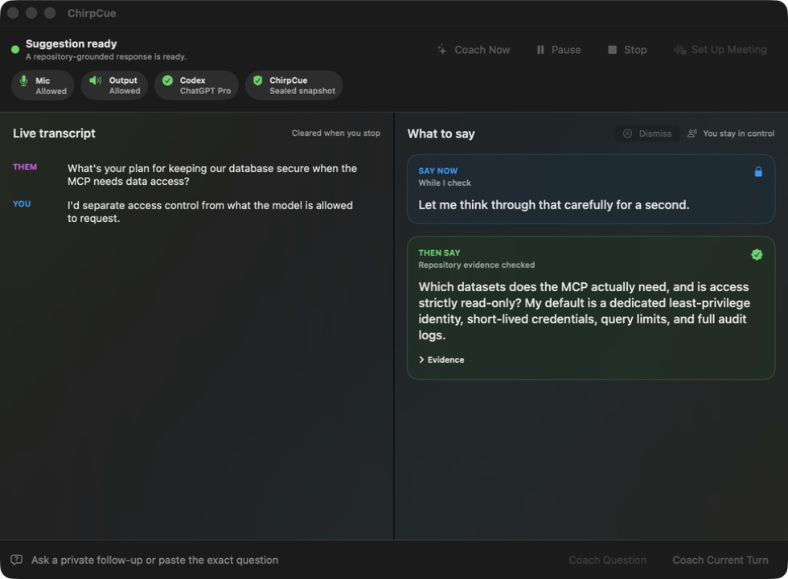
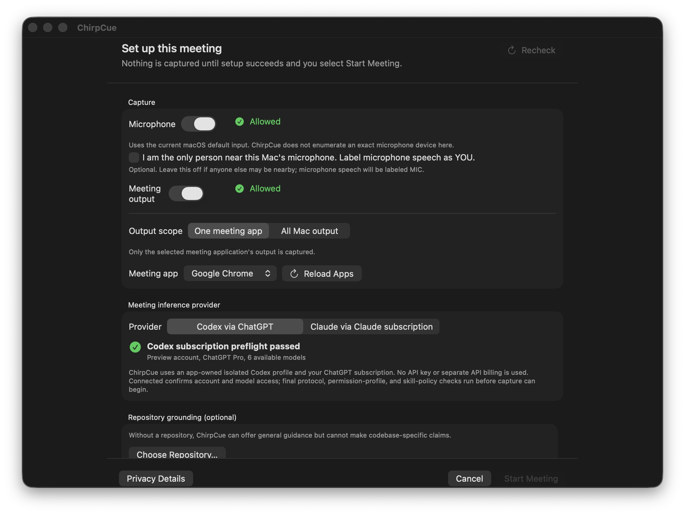
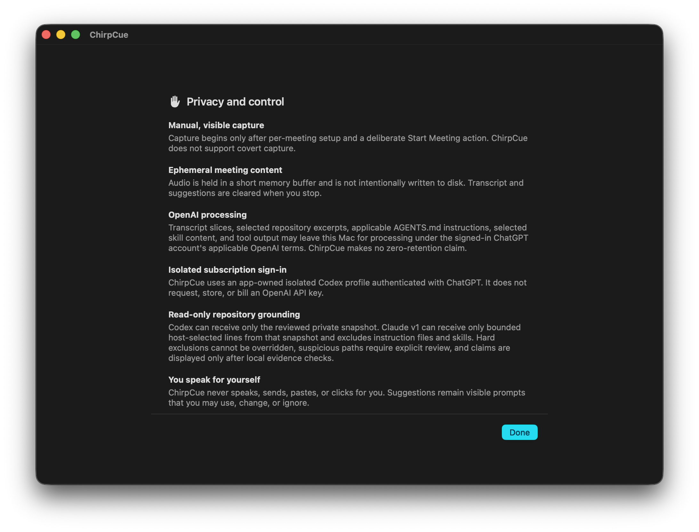

<p align="center">
  
</p>

<h1 align="center">ChirpCue</h1>

<p align="center">
  A private, consent-first macOS meeting coach that listens locally and gives you a natural sentence to say next.
</p>

<p align="center">
  <a href="https://github.com/mo-sharif/ChirpCue/actions/workflows/ci.yml"></a>
  <a href="LICENSE"></a>
  
  
</p>



<table>
  <tr>
    <td width="50%"></td>
    <td width="50%"></td>
  </tr>
  <tr>
    <td align="center">Explicit source and provider setup</td>
    <td align="center">Privacy boundaries before capture</td>
  </tr>
</table>

All screenshots use synthetic preview data and initiate no capture or provider request.

ChirpCue captures your microphone and selected Mac meeting output into separate local transcript lanes. It immediately shows a fixed bridge you can use while it thinks, then replaces that with a short staff-engineer response, clarifying question, or evidence-backed answer from one repository you explicitly sealed.

You always speak for yourself. ChirpCue never speaks, pastes, sends, clicks, joins a meeting, records secretly, or changes code.

## What makes it different

- **Universal Mac audio:** works with Google Meet, Zoom, Teams, or another meeting app by capturing the selected app's output.
- **Two-stage help:** an immediate local bridge, followed automatically by a deeper response.
- **Natural speaking prompts:** short first-person recommendations and clarifying questions instead of generic AI checklists.
- **Optional codebase grounding:** one exact read-only sealed snapshot, with local evidence verification before a repository claim is shown.
- **Subscription sign-in:** ChatGPT-authenticated Codex or a first-party personal Claude.ai Pro/Max login. No API keys.
- **Ephemeral by default:** bounded in-memory audio and transcript state, verified teardown, deletion, and residual auditing.

## Install on your Mac

The easiest supported path today builds ChirpCue locally. You need an Apple silicon Mac, macOS 26 or newer, and Xcode 26 with Swift 6.2 or newer.

```sh
git clone https://github.com/mo-sharif/ChirpCue.git
cd ChirpCue
./Scripts/build-and-install.sh
open /Applications/ChirpCue.app
```

The script builds a hardened-runtime app, verifies its bundle and privacy entitlements, and installs it into `/Applications` without overwriting an existing copy.

There is not yet a downloadable cross-Mac `.app`. Apple requires Developer ID signing and notarization for that distribution path, and ChirpCue will not ask users to bypass Gatekeeper. See [the installation guide](docs/INSTALL.md) for updates and replacement steps.

## Provider setup

Choose either provider in ChirpCue Settings:

- **Codex via ChatGPT:** ChirpCue opens a one-time sign-in for its dedicated local Codex profile. It accepts only the OpenAI-signed Codex executable bundled with ChatGPT or Codex.
- **Claude via Claude.ai:** install the official Claude Code launcher and run `claude auth login --claudeai`, then choose **Recheck**. ChirpCue accepts only first-party personal Pro or Max authentication. Console, API key, cloud, gateway, Team, Enterprise, and managed-policy paths fail closed.

Claude programmatic use can follow separate Agent SDK allowance and extra-usage terms. ChirpCue does not promise that it uses the same allowance as interactive Claude Code.

## First meeting

1. Read the in-app privacy disclosure.
2. Grant microphone, system-audio, and on-device speech permissions.
3. Select the meeting app output, such as Google Chrome for Google Meet.
4. Optionally inspect and seal one repository. Codex may use one reviewed read-only skill; Claude remains tool-free and receives only bounded host-selected lines.
5. Confirm that participants have been informed and that you have permission to process the conversation.
6. Start the meeting, then speak, edit, dismiss, or ignore every suggestion yourself.

Use **Pause** to stop capture temporarily. Use **Dismiss** to clear the current answer while transcription continues. Use **Stop** at the end so ChirpCue can join provider work, scrub memory, delete temporary state, and verify cleanup.

## Safety boundaries

ChirpCue is for permitted personal meeting assistance. Do not use it for covert recording, confidential work without approval, or an interview, exam, or assessment that forbids assistance.

Meeting text and repository content are untrusted data. They cannot change permissions, provider identity, tool policy, consent, or repository scope. Every grounded claim must pass local path, line, hash, freshness, and exact-claim checks.

Read the full [privacy contract](PRIVACY.md), [security policy](SECURITY.md), and [production-readiness ledger](PRODUCTION_READINESS.md).

## Contributing

Contributions are welcome, especially for accessibility, local audio reliability, natural response quality, deterministic cleanup, and privacy-preserving UX.

Start with [CONTRIBUTING.md](CONTRIBUTING.md) and the product boundaries in [AGENTS.md](AGENTS.md). Use synthetic meeting and repository data only.

```sh
./Scripts/check.sh
./Scripts/scan-secrets.sh
```

ChirpCue is licensed under the [Apache License 2.0](LICENSE). Community participation follows the [Code of Conduct](CODE_OF_CONDUCT.md). Report vulnerabilities through a [private security advisory](https://github.com/mo-sharif/ChirpCue/security/advisories/new), never a public issue.

## Current status

This is an early personal release candidate. Automated Swift, packaging, accessibility, Google Meet transcription, and bounded Codex smoke coverage exist, but paid Claude generation, broader device testing, real-meeting latency dogfood, and Apple-notarized binary distribution remain explicit gates.

ChirpCue is an independent open-source project and is not affiliated with or endorsed by Apple, Anthropic, Google, Microsoft, OpenAI, or Zoom.
